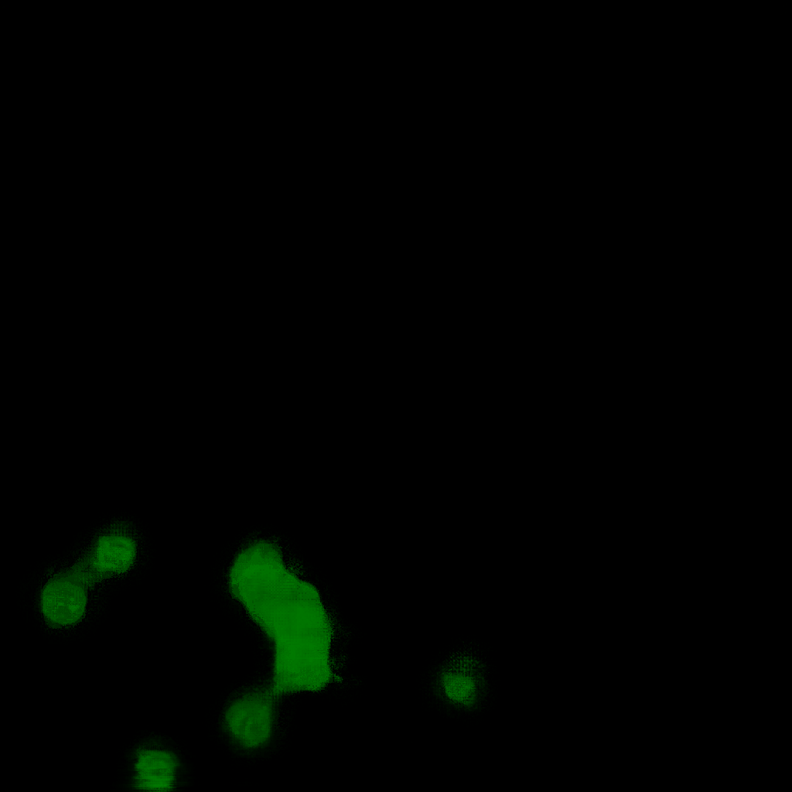

<h2>Tensorflow-Tiled-Image-Segmentation-Follicular-Cell (2024/10/10)</h2>

This is the first experiment for Follicular-Cell Segmentation based on
the <a href="https://github.com/sarah-antillia/Tensorflow-Image-Segmentation-API">Tensorflow-Image-Segmentation-API</a>, and
<a href="https://drive.google.com/file/d/1ISpL9l-Dv8k93BrqGb0V0vaab9TrQP5U/view?usp=sharing">
Tiled-Follicular-Cell-ImageMask-Dataset-V2.zip</a>, which was derived by us from 
<a href="https://drive.google.com/file/d/1t1W7tpKscqLxPApqH3JSP_zsljLHWKxQ/view?usp=sharing">IM_PatchDataset.zip.</a>.
 
 
On detail of the Tiled ImageMask Dataset, please refer to  
<a href="https://github.com/sarah-antillia/Tiled-ImageMask-Dataset-Follicular-Cell">Tiled-ImageMask-Dataset-Follicular-Cell</a>
 
 
<b>Experiment Strategies</b> 
In this experiment, we employed the following strategies. 

<b>1. Tiled ImageMask Dataset</b> 
 We trained and validated a TensorFlow UNet model using the Tiled-Follicular-Cell-ImageMask-Dataset, which was tiledly-splitted to 512x512 pixels
 and reduced to 512x512 pixels image and mask dataset.  
<b>2. Tiled Image Segmentation</b> 
We applied the Tiled-Image Segmentation inference method to predict the follicular cell regions for the mini_test images 
with a resolution of 1024x1024 pixels. 
  

<b>3. Color Space Conversion</b> 
We applied an RGB to HSV color space conversion to the input images and test images as an image preprocessor.  
 
<table>
<tr>
<th>RGB</th>
<th>HSV</th>
<th>Mask</th>
</tr>
<tr>
<td></td>
<td></td>
<td></td>

</tr>

</table>
 

<b>Actual Tiled Image Segmentation for Images of 1024x1024 pixels</b> 
As shown below, the inferred masks look similar to the ground truth masks.  

<table>
<tr>
<th>Input: image</th>
<th>Mask (ground_truth)</th>
<th>Prediction: tiled-inferred_mask</th>
</tr>
<tr>
<td></td>
<td></td>
<td></td>
</tr>

<tr>
<td></td>
<td></td>
<td></td>
</tr>

<tr>
<td></td>
<td></td>
<td></td>
</tr>

</table>

We used the simple UNet Model <a href="./src/TensorflowUNet.py">TensorflowSlightlyFlexibleUNet</a> for this Follicular-Cell Segmentation. 
As shown in <a href="https://github.com/sarah-antillia/Tensorflow-Image-Segmentation-API">Tensorflow-Image-Segmentation-API</a>.
you may try other Tensorflow UNet Models: 

<li><a href="./src/TensorflowSwinUNet.py">TensorflowSwinUNet.py</a></li>
<li><a href="./src/TensorflowMultiResUNet.py">TensorflowMultiResUNet.py</a></li>
<li><a href="./src/TensorflowAttentionUNet.py">TensorflowAttentionUNet.py</a></li>
<li><a href="./src/TensorflowEfficientUNet.py">TensorflowEfficientUNet.py</a></li>
<li><a href="./src/TensorflowUNet3Plus.py">TensorflowUNet3Plus.py</a></li>
<li><a href="./src/TensorflowDeepLabV3Plus.py">TensorflowDeepLabV3Plus.py</a></li>
 

<h3>1. Dataset Citation</h3>
Please cite these papers in your publications if it helps your research: 
<a href="https://www.sciencedirect.com/science/article/pii/S2667102621000036">
<b>pdf of Intelligent Medicine</b>
</a>
<pre>
@article{zhu2021hybrid,
  title={Hybrid model enabling highly efficient follicular segmentation in thyroid cytopathological whole slide image},
  author={Zhu, Chuang and Tao, Siyan and Chen, Huang and Li, Minzhen and Wang, Ying and Liu, Jun and Jin, Mulan},
  journal={Intelligent Medicine},
  year={2021},
  publisher={Elsevier}
}
</pre>
License: This data can be freely used for academic purposes. (non-commercial)
 

<h3>
<a id="2">
2 Follicular-Cell ImageMask Dataset
</a>
</h3>
 If you would like to train this Follicular-Cell Segmentation model by yourself,
 please download the Tiled dataset from the google drive 
<a href="https://drive.google.com/file/d/1ISpL9l-Dv8k93BrqGb0V0vaab9TrQP5U/view?usp=sharing">
Tiled-Follicular-Cell-ImageMask-Dataset-V2.zip</a>, 
 expand the downloaded ImageMaskDataset and put it under <b>./dataset</b> folder to be

<pre>
./dataset
└─Tiled-Follicular-Cell-V2
    ├─test
    │  ├─images
    │  └─masks
    ├─train
    │  ├─images
    │  └─masks
    └─valid
        ├─images
        └─masks
</pre>
 
 
<b>Tiled-Follicular-Cell Dataset V2 Statistics</b> 
 

As shown above, the number of images of train and valid dataset is not so large, but enough to use for our segmentation model.

 
 
<b>Train_images_sample</b> 

 
<b>Train_masks_sample</b> 

 

<h3>
3. Train Tensorflow UNet Model
</h3>
 We trained Follicular-Cell TensorflowUNet Model by using the configuration file
<a href="./projects/TensorflowSlightlyFlexibleUNet/Tiled-Follicular-Cell-V2/train_eval_infer.config"> <b>train_eval_infer.config</b></a> file.  
Please move to ./projects/TensorflowSlightlyFlexibleUNet/Tiled-Follicular-Cell-V2 and run the following bat file. 
<pre>
>1.train.bat
</pre>
, which simply runs the following command. 
<pre>
>python ../../../src/TensorflowUNetTrainer.py ./train_eval_infer.config
</pre>

<b>Model parameters</b> 
Defined a small <b>base_filters</b>, a large <b>base_kernels</b> and a large <b>dilation</b> for the first Conv Layer of Encoder Block of 
<a href="./src/TensorflowUNet.py">TensorflowUNet.py</a> 
and a large num_layers (including a bridge between Encoder and Decoder Blocks).
<pre>
[model]
model          = "TensorflowUNet"
generator      = True
image_width    = 512
image_height   = 512
image_channels = 3
base_filters   = 16
base_kernels   = (9,9)
num_layers     = 8
dilation       = (3,3)
</pre>

<b>Learning rate</b> 
Defined a small learning rate.  
<pre>
[model]
learning_rate  = 0.00007
</pre>

<b>Online augmentation</b> 
Enabled our online augmentation.  
<pre>
[model]
model         = "TensorflowUNet"
generator     = True
</pre>

<b>Loss and metrics functions</b> 
Specified "bce_dice_loss" and "dice_coef". 
<pre>
[model]
loss           = "bce_dice_loss"
metrics        = ["dice_coef"]
</pre>
<b>Learning rate reducer callback</b> 
Enabled learing_rate_reducer callback, and a small reducer_patience.
<pre> 
[train]
learning_rate_reducer = True
reducer_factor     = 0.4
reducer_patience   = 4
</pre>

<b>Early stopping callback</b> 
Enabled early stopping callback with patience parameter.
<pre>
[train]
patience      = 10
</pre>

<b>Image color space conversion</b> 
Enabled color space conversion.
<pre>
[image]
color_converter = "cv2.COLOR_BGR2HSV"
</pre>

<b>Mask blurring</b> 
Enabled mask blurring.
<pre>
[mask]
blur      = True
blur_size = (5,5)
</pre>

<b>Epoch change inference callbacks</b> 
Enabled epoch_change_infer and epoch_change_tiledinfer callbacks. 
<pre>
[train]
epoch_change_infer      = True
epoch_change_infer_dir  = "./epoch_change_infer"
epoch_change_tiledinfer = True
epoch_change_tiledinfer_dir = "./epoch_change_tiledinfer"
num_infer_images        = 6
</pre>

By using these callbacks, on every epoch_change, the inference procedures can be called
 for 6 images in <b>mini_test</b> folder. These will help you confirm how the predicted mask changes 
 at each epoch during your training process.    

<b>Epoch_change_inference output</b> 
 
 
<b>Epoch_change_tiled_inference output</b> 
 
 
 
In this experiment, the training process was terminated at epoch 20.  
 
 
 
<a href="./projects/TensorflowSlightlyFlexibleUNet/Tiled-Follicular-Cell-V2/eval/train_metrics.csv">train_metrics.csv</a> 
 

 
<a href="./projects/TensorflowSlightlyFlexibleUNet/Tiled-Follicular-Cell-V2/eval/train_losses.csv">train_losses.csv</a> 
 
 

<h3>
4.Evaluation
</h3>
Please move to a <b>./projects/TensorflowSlightlyFlexibleUNet/Tiled-Follicular-Cell-V2</b> folder, 
and run the following bat file to evaluate TensorflowUNet model for Follicular-Cell. 
<pre>
./2.evaluate.bat
</pre>
<pre>
python ../../../src/TensorflowUNetEvaluator.py ./train_eval_infer_aug.config
</pre>
Evaluation console output: 

 
The loss (bce_dice_loss) to this Follicular-Cell test dataset was not low, and dice_coef not high as shown below.
 
<pre>
loss,0.2749
dice_coef,0.6472
</pre>

<h2>
5. Inference
</h2>
Please move to a <b>./projects/TensorflowSlightlyFlexibleUNet/Augmented-Follicular-Cell</b> folder 
,and run the following bat file to infer segmentation regions for images by the Trained-TensorflowUNet model for Follicular-Cell. 
<pre>
./3.infer.bat
</pre>
<pre>
python ../../../src/TensorflowUNetInferencer.py ./train_eval_infer_aug.config
</pre>
Sample test images 
 
Sample test mask (ground_truth) 
 

 
Inferred test masks 
 
 

<h2>
6. Tiled Inference
</h2>
Please move to a <b>./projects/TensorflowSlightlyFlexibleUNet/Augmented-Follicular-Cell</b> folder 
,and run the following bat file to infer segmentation regions for images by the Trained-TensorflowUNet model for Follicular-Cell. 
<pre>
./4.tiled_infer.bat
</pre>

 
Tiled inferred test masks for images of 1024x1024 pixels 
 
 

<b>Enlarged images and masks of 1024x1024 pixels</b> 

<table>
<tr>
<th>Image</th>
<th>Mask (ground_truth)</th>
<th>Tiled-inferred-mask</th>
</tr>

<tr>
<td></td>
<td></td>
<td></td>
</tr>

<tr>
<td></td>
<td></td>
<td></td>
</tr>

<tr>
<td></td>
<td></td>
<td></td>
</tr>
<tr>
<td></td>
<td></td>
<td></td>
</tr>
<tr>
<td></td>
<td></td>
<td></td>
</tr>3
</table>

 

<h3>Reference</h3>
<b>1. Hybrid model enabling highly efficient follicular segmentation  
in thyroid cytopathological whole slide image </b> 
Chuang Zhu, Siyan Tao, Huang Chen, Minzhen Li, Ying Wang, Jun Liu, Mulan Jin 

https://doi.org/10.1016/j.imed.2021.04.002 
<a href="https://www.sciencedirect.com/science/article/pii/S2667102621000036">https://www.sciencedirect.com/science/article/pii/S2667102621000036</a>
 
 
<b>2. Tiled-ImageMask-Dataset-Follicular-Cell</b> 
Toshiyuki Arai @antillia.com 
<a href="https://github.com/sarah-antillia/Tiled-ImageMask-Dataset-Follicular-Cell">
https://github.com/sarah-antillia/Tiled-ImageMask-Dataset-Follicular-Cell
</a>

